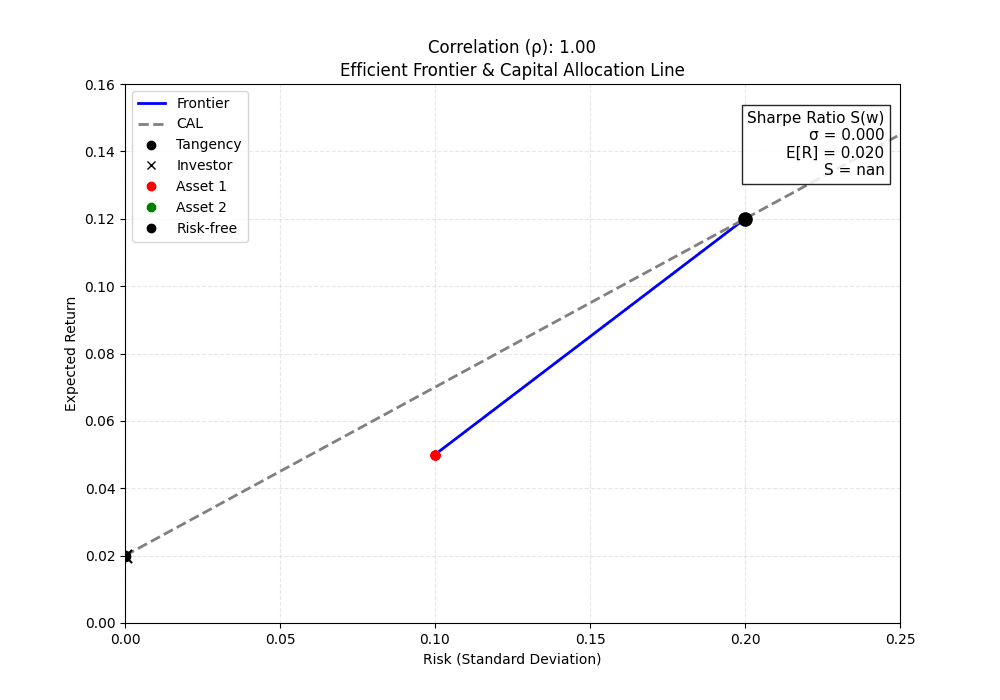

# 金融工学ノート

## Efficient Frontier & CAL アニメーション

このリポジトリには、Google Colab で作成した金融工学のノート（.ipynb）をまとめている。

## 目次

1. [01 株式](notebooks/01株式.ipynb)
2. [02 債券](notebooks/02債券.ipynb)
3. [03 ポートフォリオ理論](notebooks/03ポートフォリオ理論.ipynb)
4. [04 CAPM (Capital Asset Pricing Model) 資本資産評価モデル](notebooks/04CAPM資本資産評価モデル.ipynb)
5. [05 デリバティブ](notebooks/05デリバティブ.ipynb)
6. [06 ランダム性の取り扱い](notebooks/06ランダム性の取り扱い.ipynb)
7. [07 Black–Scholesモデル](notebooks/07ブラックショールズモデル.ipynb)
8. [08 VaR (Value at Risk)](notebooks/08VaR.ipynb)
9. [09 CDOs (Collateralized Debt Obligations)](notebooks/09CDOs.ipynb)
10. [10 Vasicekモデル](notebooks/10Vasicekモデル.ipynb)
11. [11 長期投資](notebooks/11長期投資.ipynb)

## 参考教材

- Udemy: Quantitative Finance & Algorithmic Trading in Python（Holczer Balazs）
  → 本リポジトリの全体構成は本講座に基づく。
   
- 中妻照雄『Pythonによるファイナンス入門』（朝倉書店）
  → 第2章（債券）、第3章（ポートフォリオ理論）に参照

- 吉川大介『データ駆動型ファイナンス ― 基礎理論からPython機械学習による応用 ―』（共立出版）
  → 第3章（ポートフォリオ理論）、第4章（CAPM）に参照
  
- 永野学『図解いちばん面白いデリバティブ入門』（東洋経済新報社）
  → 第5章（デリバティブ）に参照

- 石村貞夫・石村園子『金融・証券のためのブラック・ショールズ微分方程式』（東京図書）
  → 第6章（ランダム性の数理）、第7章（Black-Scholesモデル）に参照

- 伏屋広隆『ブラック・ショールズモデル超入門』（森北出版）
  → 第6章（ランダム性の数理）、第7章（Black-Scholesモデル）に参照

- 「確率微分方程式入門」講義資料（PDF）
  https://yuima.movabletype.io/past/.assets/koike_slide2.pdf
  → 第10章（Vasicekモデル）に参照
